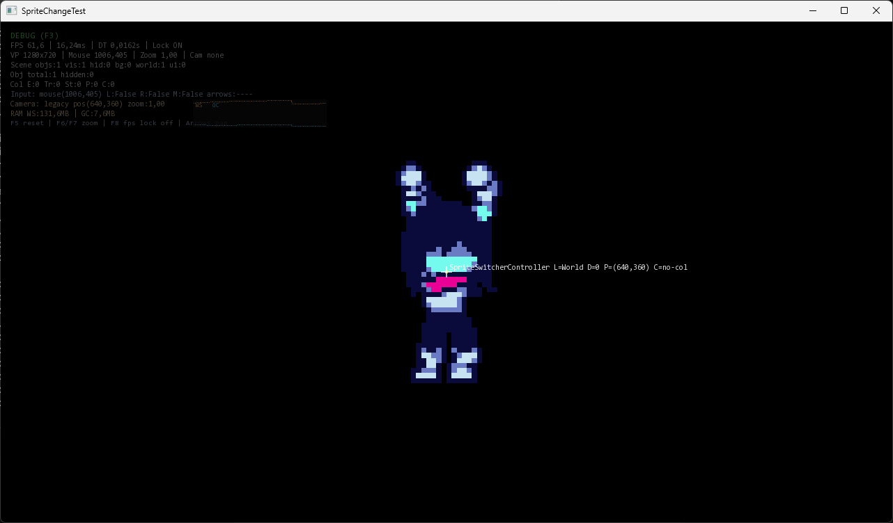

<p align="center">
  
</p>

# Testboxed Runtime

> Testboxed is a sort of standard for 2D games that specifies what the APIs and file formats should be, and how everything fits together. I developed it myself, as neither GameMaker nor Unity suited my needs.

> Even it's mostly vibe-coded (made with help of AI), it's working stable, and I developed the engine's architecture myself.

> And I say one thing, just for fun: Testboxed Runtime is partially inspired by Deltarune and OneShot, not only because of the deeper meaning behind these games, but also because of their top-down movement and simple graphics style.

## Features
- Built-in debug mode overlay (F3)
- Dynamic C# script compilation (like Unity)
- 2D rendering (SFML.Net, but custom backend can be added)
- Physics (AABB box colliders) - `ru.tlpteam.tb.Physics`
- Audio API - `ru.tlpteam.tb.Audio`
- Input API - `ru.tlpteam.Input`, and i know it's still called ru.tlpteam.TlpInput in folders, don't ask why
- Built-in UI API - `ru.tlpteam.tb.UI`

## How to use
You can view documentation [here](https://docs-tb.thelittlepony.ru/Introduction/Welcome/)

## How to run
Requires .NET 10 to run.

```
dotnet run -- <ABSOLUTE_OR_RELATIVE_PROJECT_PATH> --initial-scene SceneName
```

You can look on example/demo projects for this engine [here](https://github.com/thelittlepony/Testboxed-Examples).

## Runtime modes
Reference:
- [TestboxedEngine.Run](https://github.com/thelittlepony/Testboxed-Runtime/blob/main/src/ru.tlpteam.tb.Runtime.Engine/TestboxedEngine.cs#L84)
- [GenocideRouteEngine.Run](https://github.com/thelittlepony/Testboxed-Runtime/blob/main/src/ru.tlpteam.tb.Runtime.Engine/GenocideRouteEngine.cs#L101)
- [WhiteSpaceEngine.Run](https://github.com/thelittlepony/Testboxed-Runtime/blob/main/src/ru.tlpteam.tb.Runtime.Engine/WhiteSpaceEngine.cs#L101)

| Mode | Rendering | Logic | Audio |
| :--- | :--- | :--- | :--- |
| TestboxedEngine | Main | Main | Main |
| GenocideRouteEngine | Main | Thread 1 | Thread 2 |
| WhiteSpaceEngine | Off (Dummy) | Main | Off |

## Building for other
Linux ARM64:
```
dotnet build ru.tlpteam.tb.Runtime.csproj -c Release -r linux-arm64 --self-contained true -p:PlatformTarget=AnyCPU
```

## Screenshots
<p align="center">
  
</p>
